```mermaid
graph TD
    subgraph Hub Cluster
        User --> A[ApplicationSet]
        A --> B[Placement]
        B --> C[ClusterSet]
        A --> D[GitOpsCluster]

        %% Missing Backend Components
        subgraph Application Lifecycle Backend
            APP_OP[multicloud-operators-application] -- Manages --> ACM_APP[ACM Application CR<br/>application.app.k8s.io]
            APP_OP -- Collects Subscriptions --> ALL_SUBS[All Involved Subscriptions]
            APP_OP -- Imports Cluster Secrets --> ARGOCD_NAMESPACE[ArgoCD Server Namespace]
            
            CHANNEL_OP[multicloud-operators-channel] -- Connects to --> GIT_REPO[Git Repository]
            CHANNEL_OP -- Connects to --> HELM_REPO[Helm Repository]
            CHANNEL_OP -- Connects to --> OBJECT_STORE[Object Store<br/>MinIO, AWS S3]
            CHANNEL_OP -- Creates --> ACM_CHANNEL[ACM Channel CR<br/>channel.apps.open-cluster-management.io]
            
            SUB_OP[multicloud-operators-subscription] -- Creates --> PARENT_SUB[Parent Subscription Deployable]
            SUB_OP -- Manages --> ACM_SUB[ACM Subscription CR<br/>subscription.apps.open-cluster-management.io]
            SUB_OP -- Reports Status --> ACM_SUB_STATUS[ACM Subscription Status CR<br/>subscriptionstatus.apps.open-cluster-management.io]
            
            PLACEMENT_OP[multicloud-operators-placementrule] -- Generates --> TARGET_CLUSTERS[Target Managed Clusters List]
            PLACEMENT_OP -- Creates --> ACM_PLACEMENT[ACM Placement Rule CR<br/>placementrule.apps.open-cluster-management.io]
            
            INTEGRATIONS_OP[multicloud-integrations] -- Creates --> MANIFESTWORK[ManifestWork]
            INTEGRATIONS_OP -- Propagates --> ARGOCD_APPS[ArgoCD Applications to Managed Clusters]
            INTEGRATIONS_OP -- Queries --> SEARCH_API[Search API on Managed Cluster]
            INTEGRATIONS_OP -- Builds --> APP_SET_REPORT[Application Set Report]
            
            SUB_REPORT_OP[multicloud-operators-subscription-report] -- Aggregates --> CLUSTER_REPORTS[Cluster Level Reports]
            SUB_REPORT_OP -- Creates --> APP_REPORTS[App Level Reports]
            SUB_REPORT_OP -- Manages --> ACM_SUB_REPORT[ACM Subscription Report CR<br/>subscriptionreport.apps.open-cluster-management.io]
            
            CLUSTER_PERM_OP[cluster-permission] -- Creates --> RBAC_MANIFESTWORK[RBAC ManifestWork]
            CLUSTER_PERM_OP -- Distributes --> RBAC_RESOURCES[RBAC Resources<br/>Role, RoleBinding, ClusterRole, ClusterRoleBinding]
            CLUSTER_PERM_OP -- Manages --> ACM_CLUSTER_PERM[ACM ClusterPermission CR<br/>clusterpermission.rbac.open-cluster-management.io]
        end

        %% Add-on Framework Integration
        User -- Configures --> ADT[AddOnTemplate]
        User -- Configures --> ADD[AddOnDeploymentConfig]
        ADT --> CMA[ClusterManagementAddOn]
        ADD --> CMA

        CMA -- Orchestrates Deployment --> GAC[gitops-addon Controller on Spoke]
        CMA -- Orchestrates Deployment --> OGO[OpenShift GitOps Operator on Spoke]

        %% Managed Service Account Integration
        GCHC[gitopscluster-controller] -- Watches --> MSA[ManagedServiceAccount]
        MSA -- Creates Short-Lived Tokens --> STC[spoke-token-controller on Spoke]
        
        %% GitOpsCluster Integration
        D -- Configures/Integrates with --> ARGOCD_HUB[ArgoCD Server on Hub]
        D -- Imports Cluster Secrets --> ARGOCD_NAMESPACE
        D -- Manages --> ACM_GITOPS_CLUSTER[ACM GitOpsCluster CR<br/>gitopscluster.apps.open-cluster-management.io]
        
        %% External Dependencies
        D -- Pulls Manifests --> GR[Git Repository]
        D -- Pulls Manifests --> HR[Helm Repository]
        D -- Pulls Manifests --> OS[Object Storage]
        
        %% Ansible Integration
        ANSIBLE_INTEGRATION[Ansible Integration] -- Connects to --> ANSIBLE_TOWER[Ansible Tower]
        ANSIBLE_INTEGRATION -- Uses --> ANSIBLE_TOKEN[Access Token]
        ANSIBLE_INTEGRATION -- Creates --> ANSIBLE_JOB[AnsibleJob CR]
    end

    subgraph Managed Cluster Spoke 1..N
        %% Add-on Framework on Managed Cluster
        MCA1[ManagedClusterAddOn] -- Deploys --> GAC
        MCA1 -- Deploys --> OGO

        GAC --> OGO
        OGO -- Manages --> ARGOCD1[ArgoCD Instance]
        ARGOCD1 -- Deploys Applications --> TC1[Target Cluster Resources<br/>Deployments, Pods, Secrets]
        STC -- Connects Securely --> ARGOCD1
        
        %% Missing Managed Cluster Components
        SUB_OP_MC[multicloud-operators-subscription<br/>on Managed Cluster] -- Deploys Resources from --> GIT_REPO
        SUB_OP_MC -- Deploys Resources from --> OBJECT_STORE
        SUB_OP_MC -- Manages --> ACM_SUB_STATUS_MC[ACM Subscription Status CR<br/>on Managed Cluster]
        
        HELM_RELEASE_OP[multicloud-operators-subscription-release<br/>helmrelease] -- Deploys --> PARENT_SUB_MC[Parent Subscription]
        HELM_RELEASE_OP -- Deploys Resources from --> HELM_REPO
        HELM_RELEASE_OP -- Manages --> ACM_HELMRELEASE[ACM HelmRelease CR<br/>helmrelease.apps.open-cluster-management.io]
        
        %% RBAC Resources on Managed Cluster
        RBAC_RESOURCES_MC[RBAC Resources on Managed Cluster] -- Includes --> ROLES[Roles]
        RBAC_RESOURCES_MC -- Includes --> ROLEBINDINGS[RoleBindings]
        RBAC_RESOURCES_MC -- Includes --> CLUSTERROLES[ClusterRoles]
        RBAC_RESOURCES_MC -- Includes --> CLUSTERROLEBINDINGS[ClusterRoleBindings]
    end

    %% External Systems
    subgraph External Systems
        GITHUB[GitHub] -- Stores Application Manifests --> GIT_REPO
        HELM_REPOSITORIES[Helm Repositories] -- Stores Helm Charts --> HELM_REPO
        OBJECT_STORAGE_SYSTEMS[Object Storage Systems<br/>MinIO, AWS S3] -- Stores Application Artifacts --> OBJECT_STORE
        ANSIBLE_TOWER[Ansible Tower] -- Receives Jobs from --> ANSIBLE_INTEGRATION
    end

    %% Cross-Pillar Dependencies
    subgraph Other ACM Pillars
        SEARCH[Search API] -- Queried by --> INTEGRATIONS_OP
        SERVER_FOUNDATION[Server Foundation] -- Provides Communication --> HUB_MANAGED_COMM[Hub-Managed Cluster Communication]
        CONSOLE[Console/UI] -- Integrates with --> APP_OP
        CONSOLE -- Integrates with --> CHANNEL_OP
        CONSOLE -- Integrates with --> SUB_OP
    end

    %% Data Flow Dependencies
    MANIFESTWORK -- Propagates to --> SUB_OP_MC
    MANIFESTWORK -- Propagates to --> HELM_RELEASE_OP
    MANIFESTWORK -- Propagates to --> RBAC_RESOURCES_MC
    
    %% Certificate Dependencies
    CHANNEL_OP -- Uses Certificates --> CHANNEL_CERTS[Channel Certificates<br/>Trusted or Insecure]
    SUB_OP -- Uses Certificates --> SUB_CERTS[Subscription Certificates<br/>Trusted or Insecure]
    ARGOCD1 -- Uses Certificates --> ARGOCD_CERTS[ArgoCD Certificates]
    
    %% Webhook Dependencies
    CHANNEL_OP -- Uses --> CHANNEL_WEBHOOK[Channel Validating Webhook]
    APP_OP -- Uses --> APP_WEBHOOK[Application Validating Webhook]
    
    %% Styling
    classDef hub fill:#e1f5fe,stroke:#01579b,stroke-width:2px
    classDef managed fill:#f3e5f5,stroke:#4a148c,stroke-width:2px
    classDef external fill:#f1f8e9,stroke:#33691e,stroke-width:2px
    classDef other fill:#fff3e0,stroke:#e65100,stroke-width:2px
    classDef crd fill:#fce4ec,stroke:#880e4f,stroke-width:2px

    class A,B,C,D,APP_OP,CHANNEL_OP,SUB_OP,PLACEMENT_OP,INTEGRATIONS_OP,SUB_REPORT_OP,CLUSTER_PERM_OP hub
    class GAC,OGO,ARGOCD1,TC1,SUB_OP_MC,HELM_RELEASE_OP,RBAC_RESOURCES_MC managed
    class GITHUB,HELM_REPOSITORIES,OBJECT_STORAGE_SYSTEMS,ANSIBLE_TOWER external
    class SEARCH,SERVER_FOUNDATION,CONSOLE other
    class ACM_APP,ACM_CHANNEL,ACM_SUB,ACM_SUB_STATUS,ACM_PLACEMENT,ACM_SUB_REPORT,ACM_CLUSTER_PERM,ACM_GITOPS_CLUSTER,ACM_HELMRELEASE crd
```

**Explanation of Application Lifecycle Dependencies:**

The Application Lifecycle component in ACM has comprehensive dependencies across multiple layers:

**I. Hub Cluster Components**
- **multicloud-operators-application**: Manages ACM Application CRs, collects subscriptions, and imports cluster secrets to ArgoCD namespaces
- **multicloud-operators-channel**: Connects to external repositories (Git, Helm, Object stores) and manages ACM Channel CRs
- **multicloud-operators-subscription**: Creates parent subscription deployables and manages ACM Subscription CRs
- **multicloud-operators-placementrule**: Generates target cluster lists and manages ACM Placement Rule CRs
- **multicloud-integrations**: Creates ManifestWork to propagate ArgoCD applications and queries Search API
- **multicloud-operators-subscription-report**: Aggregates cluster-level reports to app-level reports
- **cluster-permission**: Distributes RBAC resources to managed clusters

**II. Managed Cluster Components**
- **multicloud-operators-subscription**: Deploys resources from Git repos and object stores on managed clusters
- **multicloud-operators-subscription-release**: Deploys parent subscriptions and resources from Helm repos
- **gitops-addon Controller**: Manages GitOps operations on managed clusters
- **OpenShift GitOps Operator**: Manages ArgoCD instances on managed clusters
- **spoke-token-controller**: Provides secure connections to ArgoCD instances

**III. Custom Resources (CRDs)**
- **ACM Application CR**: Groups ACM subscriptions that make up an application
- **ACM Channel CR**: Defines source repositories for subscriptions
- **ACM Subscription CR**: Subscribes to source repositories
- **ACM Subscription Status CR**: Stores detailed subscription status on managed clusters
- **ACM Subscription Report CR**: Stores summary status on hub cluster
- **ACM Placement Rule CR**: Defines target clusters for resource deployment
- **ACM GitOpsCluster CR**: Imports ACM cluster secrets to ArgoCD namespaces
- **ACM ClusterPermission CR**: Distributes RBAC resources
- **ACM HelmRelease CR**: Internal component for Helm chart deployment

**IV. External Dependencies**
- **GitHub**: Stores application manifests and configurations
- **Helm Repositories**: Stores Helm charts for application deployment
- **Object Storage**: Stores application artifacts (MinIO, AWS S3)
- **Ansible Tower**: Receives automation jobs for application deployment (ACM 2.1+)
- **Argo CD**: Manages GitOps workflows (ACM 2.2+)

**V. Cross-Pillar Dependencies**
- **Search API**: Queried for application set reports and resource discovery
- **Server Foundation**: Provides secure communication between hub and managed clusters
- **Console/UI**: Provides user interface for application lifecycle management

**VI. Data Flow Dependencies**
- **ManifestWork Propagation**: Distributes resources from hub to managed clusters
- **Certificate Management**: TLS certificates for secure connections to external repositories
- **Webhook Validation**: Validating webhooks for channels and applications
- **RBAC Distribution**: Role-based access control resources distributed to managed clusters

**VII. Add-on Framework Integration**
- **Add-on Framework**: Manages deployment and lifecycle of Application Lifecycle components
- **ManagedServiceAccount**: Provides short-lived tokens for secure cluster access
- **ClusterManagementAddOn**: Orchestrates add-on deployment across managed clusters

This dependency mapping shows that Application Lifecycle is deeply integrated with ACM's core infrastructure, requiring coordination with Search, Server Foundation, external repositories, and automation tools to provide comprehensive application deployment and management across the cluster fleet.
    

    