Red Hat Advanced Cluster Management (ACM) for Kubernetes provides extensive capabilities for managing the lifecycle of clusters across various environments. This "Cluster Lifecycle" pillar is foundational, enabling the creation, import, management, and decommissioning of clusters, upon which other ACM functionalities, such as Application Lifecycle, Observability, and Governance, are built.

Here's a dependency diagram illustrating the key components and their interactions within the **Cluster Lifecycle** pillar, including how other pillars interact with the managed clusters:

```mermaid

graph TD
    subgraph Hub Cluster Management Plane
        User[User / Admin] --> Console[ACM Console]
        Console --> ClusterDeployment[ClusterDeployment CR]
        Console --> ManagedCluster[ManagedCluster CR]
        Console --> ClusterAddOnConfig[Cluster Add-on Config CR]

        subgraph Core Cluster Management Foundation Team
            ManagedCluster -- Reflects status from --> KlusterletAgent
            ManagedClusterImportController[Managed Cluster Import Controller] -- Deploys --> KlusterletOperator
            ManagedClusterImportController -- Creates --> KlusterletCR[Klusterlet CR]
            KlusterletAgent -- Registers with --> RegistrationController[Registration Controller]
            AddOnManager[AddOn Manager] -- Creates --> ManagedClusterAddOn[ManagedClusterAddOn CR]
            ManagedClusterAddOn -- Reconciled by --> AddOnControllers[AddOn Specific Controllers]
            AddOnControllers -- Generates manifests for --> ManifestWorkCRs[ManifestWork CRs]

            ClusterSet[ClusterSet] -- Groups for --> Placement[Placement defines target clusters]
        end

        subgraph Cluster Provisioning Engines Hub-side
            ClusterDeployment --> HiveOperator[Hive Operator]
            HiveOperator -- Creates/Manages --> HiveClusterDeployment[ClusterDeployment CR Hive]
            ClusterDeployment --> CAPIControllers[CAPI Core & Provider Controllers]
            ClusterDeployment --> HypershiftAddonManager[Hypershift Add-on Manager]
            HypershiftAddonManager -- Manages --> HostedCluster[HostedCluster CR]
            HostedCluster --> NodePool[NodePool CR]

            SiteConfigOperator[SiteConfig Operator] -- Renders templates for --> InstallationManifests[Installation Manifests]
            InstallationManifests -- Contains --> HiveClusterDeployment
            User -- Provides manifests to --> SiteConfigOperator

            ImageBasedInstallOperator[Image Based Install Operator IBIO] -- Uses OpenShift Installer for --> ConfigISO[Configuration ISO]
            ImageBasedInstallOperator -- Works with --> ClusterBaremetalOperator[Cluster Baremetal Operator BMO]
            InfrastructureOperator[Infrastructure Operator CIM] -- Uses --> AssistedService[Assisted Service]
            AssistedService -- Manages hosts for --> ClusterBaremetalOperator
        end

        subgraph Other Pillar Components Hub-side
            gitopsclustercontroller[gitopscluster-controller] -- Watches --> ManagedServiceAccount[ManagedServiceAccount]
            ManagedServiceAccount -- Creates short-lived tokens --> SpokeTokenController[spoke-token-controller]

            MCOperator[MultiCluster Observability Operator] --> Thanos[Thanos Metric Store]
            MCOperator --> AlertManager[AlertManager]
            MCOperator --> Grafana[Grafana]
            MCOAddon[MultiCluster Observability Add-on MCOA] -- Add-on framework native --> ManagedClusterAddOn

            DR4Hub[DR4Hub Operator] -- Manages backups of hub resources --> Velero[Velero]
            Velero -- Stores to --> StorageSecret[Storage Secret]
            OADPOperator[OADP Operator] --> Velero
            VolSyncAddonController[VolSync Addon Controller] -- Deploys --> VolSyncOperatorManaged[VolSync Operator on Managed]

            PolicyPropagator[Policy Propagator] --> PolicyCRs[Policy Custom Resources]
            PolicyCRs --> PlacementBinding[PlacementBinding]
            GRCAddonController[GRC Addon Controller] -- Orchestrates policy components --> ManagedClusterAddOn

            GlobalHubOperator[Multicluster Global Hub Operator] --> MGHManager[Multicluster Global Hub Manager]

            SearchV2Operator[Search-v2-operator] --> PostgreSQL[PostgreSQL Database]
            SearchV2Operator --> SearchIndexer[Search-indexer]
            SearchAPI[Search-api] -- Queries --> PostgreSQL
        end
    end

    subgraph Managed Cluster Workload Plane
        KlusterletOperator[Klusterlet Operator] -- Deploys --> KlusterletAgent[Klusterlet Agent]
        KlusterletAgent -- Pulls & Applies --> ManifestWorkCRs
        KlusterletAgent -- Installs/Configures --> AddOnAgents[Generic AddOn Agents]

        KlusterletAgent -- Registers with --> RegistrationController

        AddOnAgents --> OpenShiftGitOpsOperatorManaged[OpenShift GitOps Operator]
        OpenShiftGitOpsOperatorManaged --> ArgoCDInstance[ArgoCD Instance]
        ArgoCDInstance -- Deploys/Manages --> TargetClusterResources[Target Kubernetes Resources]
        SpokeTokenController[spoke-token-controller] -- Securely connects --> ArgoCDInstance

        AddOnAgents --> MetricsCollector[Metrics Collector]
        MetricsCollector -- Collects from --> Prometheus[Prometheus on Managed]
        MetricsCollector -- Forwards to --> MCOAddon
        AddOnAgents --> ClusterLoggingOperator[OpenShift Cluster Logging Operator]
        ClusterLoggingOperator -- Forwards logs --> ExternalLogSource[External Log Source]
        AddOnAgents --> OpenTelemetryOperator[OpenTelemetry Operator]
        OpenTelemetryOperator -- Forwards traces --> ExternalTraceSource[External Trace Source]

        AddOnAgents --> VolSyncOperatorManaged[VolSync Operator]
        VolSyncOperatorManaged -- Replicates --> PersistentVolumes[Persistent Volumes]

        AddOnAgents --> GovernancePolicyFramework[Governance Policy Framework]
        GovernancePolicyFramework --> Gatekeeper[Gatekeeper if installed]

        AddOnAgents --> SubmarinerOperatorManaged[Submariner Operator]
        SubmarinerOperatorManaged --> SubmarinerGateway[Submariner Gateway]
        SubmarinerGateway -- Establishes connections --> OtherManagedClusters[Other Managed Clusters]

        AddOnAgents --> SearchCollector[Search Collector]
        SearchCollector -- Sends data to --> SearchIndexer
    end

    subgraph External Infrastructure / Data Sources
        CloudProviders[Cloud Providers -AWS, Azure, GCP, OpenStack, etc.]
        BareMetal[Bare Metal Servers]
        GitRepo[Git Repository]
        HelmRepo[Helm Repository]
        ObjectStorage[Object Storage]
        ThirdPartyObservability[Third-Party Observability Tools]
        ExternalAlertingSystems[External Alerting Systems]

        ClusterDeployment -- Targets --> CloudProviders
        ClusterDeployment -- Targets --> BareMetal
        CAPIControllers -- Interacts with --> CloudProviders
        HypershiftAddonManager -- Provisions worker nodes in --> CloudProviders
        InfrastructureOperator -- Provisions hosts in --> CloudProviders
        InfrastructureOperator -- Provisions hosts in --> BareMetal
        ImageBasedInstallOperator -- Provisions onto --> BareMetal

        ArgoCDInstance -- Pulls manifests from --> GitRepo
        ArgoCDInstance -- Pulls manifests from --> HelmRepo
        ArgoCDInstance -- Pulls manifests from --> ObjectStorage
        MCOperator -- Exports to --> ThirdPartyObservability
        AlertManager -- Forwards alerts to --> ExternalAlertingSystems

        style User fill:#fff,stroke:#333,stroke-width:2px
        style Console fill:#fff,stroke:#333,stroke-width:2px
        style ClusterDeployment fill:#fff,stroke:#333,stroke-width:2px
        style ManagedCluster fill:#fff,stroke:#333,stroke-width:2px
        style ClusterAddOnConfig fill:#fff,stroke:#333,stroke-width:2px
        style ManagedClusterImportController fill:#fff,stroke:#333,stroke-width:2px
        style RegistrationController fill:#fff,stroke:#333,stroke-width:2px
        style AddOnManager fill:#fff,stroke:#333,stroke-width:2px
        style ManagedClusterAddOn fill:#fff,stroke:#333,stroke-width:2px
        style AddOnControllers fill:#fff,stroke:#333,stroke-width:2px
        style ManifestWorkCRs fill:#fff,stroke:#333,stroke-width:2px
        style ClusterSet fill:#fff,stroke:#333,stroke-width:2px
        style Placement fill:#fff,stroke:#333,stroke-width:2px
        style HiveOperator fill:#fff,stroke:#333,stroke-width:2px
        style HiveClusterDeployment fill:#fff,stroke:#333,stroke-width:2px
        style CAPIControllers fill:#fff,stroke:#333,stroke-width:2px
        style HypershiftAddonManager fill:#fff,stroke:#333,stroke-width:2px
        style HostedCluster fill:#fff,stroke:#333,stroke-width:2px
        style NodePool fill:#fff,stroke:#333,stroke-width:2px
        style SiteConfigOperator fill:#fff,stroke:#333,stroke-width:2px
        style InstallationManifests fill:#fff,stroke:#333,stroke-width:2px
        style ImageBasedInstallOperator fill:#fff,stroke:#333,stroke-width:2px
        style ConfigISO fill:#fff,stroke:#333,stroke-width:2px
        style ClusterBaremetalOperator fill:#fff,stroke:#333,stroke-width:2px
        style AssistedService fill:#fff,stroke:#333,stroke-width:2px
        style KlusterletCR fill:#fff,stroke:#333,stroke-width:2px
        style KlusterletOperator fill:#fff,stroke:#333,stroke-width:2px
        style KlusterletAgent fill:#fff,stroke:#333,stroke-width:2px
        style AddOnAgents fill:#fff,stroke:#333,stroke-width:2px
        style gitopsclustercontroller fill:#fff,stroke:#333,stroke-width:2px
        style ManagedServiceAccount fill:#fff,stroke:#333,stroke-width:2px
        style SpokeTokenController fill:#fff,stroke:#333,stroke-width:2px
        style MCOperator fill:#fff,stroke:#333,stroke-width:2px
        style Thanos fill:#fff,stroke:#333,stroke-width:2px
        style AlertManager fill:#fff,stroke:#333,stroke-width:2px
        style Grafana fill:#fff,stroke:#333,stroke-width:2px
        style MCOAddon fill:#fff,stroke:#333,stroke-width:2px
        style DR4Hub fill:#fff,stroke:#333,stroke-width:2px
        style Velero fill:#fff,stroke:#333,stroke-width:2px
        style StorageSecret fill:#fff,stroke:#333,stroke-width:2px
        style OADPOperator fill:#fff,stroke:#333,stroke-width:2px
        style VolSyncAddonController fill:#fff,stroke:#333,stroke-width:2px
        style PolicyPropagator fill:#fff,stroke:#333,stroke-width:2px
        style PolicyCRs fill:#fff,stroke:#333,stroke-width:2px
        style PlacementBinding fill:#fff,stroke:#333,stroke-width:2px
        style GRCAddonController fill:#fff,stroke:#333,stroke-width:2px
        style GlobalHubOperator fill:#fff,stroke:#333,stroke-width:2px
        style MGHManager fill:#fff,stroke:#333,stroke-width:2px
        style SearchV2Operator fill:#fff,stroke:#333,stroke-width:2px
        style PostgreSQL fill:#fff,stroke:#333,stroke-width:2px
        style SearchIndexer fill:#fff,stroke:#333,stroke-width:2px
        style SearchAPI fill:#fff,stroke:#333,stroke-width:2px
        style OpenShiftGitOpsOperatorManaged fill:#fff,stroke:#333,stroke-width:2px
        style ArgoCDInstance fill:#fff,stroke:#333,stroke-width:2px
        style TargetClusterResources fill:#fff,stroke:#333,stroke-width:2px
        style MetricsCollector fill:#fff,stroke:#333,stroke-width:2px
        style Prometheus fill:#fff,stroke:#333,stroke-width:2px
        style ClusterLoggingOperator fill:#fff,stroke:#333,stroke-width:2px
        style OpenTelemetryOperator fill:#fff,stroke:#333,stroke-width:2px
        style VolSyncOperatorManaged fill:#fff,stroke:#333,stroke-width:2px
        style PersistentVolumes fill:#fff,stroke:#333,stroke-width:2px
        style GovernancePolicyFramework fill:#fff,stroke:#333,stroke-width:2px
        style Gatekeeper fill:#fff,stroke:#333,stroke-width:2px
        style SubmarinerOperatorManaged fill:#fff,stroke:#333,stroke-width:2px
        style SubmarinerGateway fill:#fff,stroke:#333,stroke-width:2px
        style OtherManagedClusters fill:#fff,stroke:#333,stroke-width:2px
        style SearchCollector fill:#fff,stroke:#333,stroke-width:2px
        style CloudProviders fill:#fff,stroke:#333,stroke-width:2px
        style BareMetal fill:#fff,stroke:#333,stroke-width:2px
        style GitRepo fill:#fff,stroke:#333,stroke-width:2px
        style HelmRepo fill:#fff,stroke:#333,stroke-width:2px
        style ObjectStorage fill:#fff,stroke:#333,stroke-width:2px
        style ThirdPartyObservability fill:#fff,stroke:#333,stroke-width:2px
        style ExternalLogSource fill:#fff,stroke:#333,stroke-width:2px
        style ExternalTraceSource fill:#fff,stroke:#333,stroke-width:2px
        style ExternalAlertingSystems fill:#fff,stroke:#333,stroke-width:2px
    end
```

**Explanation of Components and Interactions within the Cluster Lifecycle Pillar:**

The Cluster Lifecycle pillar in Red Hat Advanced Cluster Management is primarily managed by the **Foundation Team** and includes several core functionalities for comprehensive cluster management.

**I. Hub Cluster (Management Plane)**

The Hub Cluster acts as the central control plane where users define, manage, and monitor their cluster fleet.

*   **User and Console**: The process begins with a **User** interacting with the **ACM Console** to initiate cluster creation or management tasks. The console creates Kubernetes resources such as **ClusterDeployment**, **ManagedCluster**, and **ClusterAddOnConfig** Custom Resources (CRs) based on user input.
*   **Core Cluster Management (Foundation Team)**: This squad delivers the core functionalities of ACM, including cluster importing, detaching, manifest distribution, add-on management, and multi-cluster scheduling.
    *   The **ManagedCluster CR** on the hub represents each managed cluster and its status is continuously updated by agents on the managed cluster.
    *   The **Managed Cluster Import Controller** is responsible for deploying the **Klusterlet Operator** and creating the **Klusterlet CR** on a newly provisioned or imported managed cluster. Notably, it also handles the auto-import of Cluster API (CAPI) clusters.
    *   The **Registration Controller** on the hub facilitates the registration of managed clusters by the **Klusterlet Agent**.
    *   For add-on management, the **AddOn Manager** creates **ManagedClusterAddOn CRs** on the hub for each managed cluster. These are then reconciled by **AddOn Specific Controllers**, which generate **ManifestWork CRs** containing the necessary manifests to deploy add-on agents on the managed clusters.
    *   **ClusterSet** and **Placement** CRs are used to group clusters and define targets for policies, applications, or add-on deployments across the managed fleet.
*   **Cluster Provisioning Engines**: ACM integrates with various operators to provision different types of clusters:
    *   **Hive Operator**: Used for **Installer-Provisioned Infrastructure (IPI)** OpenShift clusters, creating and managing **ClusterDeployment CRs (Hive)** that define the cluster installation.
    *   **Cluster API (CAPI) Controllers**: The core CAPI component and its cloud-specific providers (like **CAPA** for AWS, **CAPZ** for Azure, and **CAPM** for bare metal) provide a declarative way to provision and manage Kubernetes clusters across various platforms. CAPI clusters can be automatically imported into ACM.
    *   **Hypershift Add-on Manager**: Manages the deployment of **Hosted Control Planes (HCP)**, which run as pods within the management cluster itself, provisioning workers via **HostedCluster CRs** and **NodePool CRs**. ACM's Discovery Operator can auto-import these hosted clusters.
    *   **Infrastructure Operator (CIM)**: This operator, shipped with ACM and MCE, runs **Assisted Service** to install additional OpenShift clusters, exposing Kubernetes APIs for cluster lifecycle management. It integrates with the **Cluster Baremetal Operator (BMO)** to manage **BareMetalHost** CRs for bare metal deployments.
    *   **SiteConfig Operator**: Provides a template-driven provisioning solution that can be used for large-scale cluster deployments. It watches **ClusterInstance CRs** (the common cluster configuration API), fetches **Installation Templates**, and renders **Installation Manifests** that include ClusterDeployment CRs for provisioning. It also supports **Cluster Reinstall (Image Based Break-Fix)** to reprovision clusters while preserving identity.
    *   **Image Based Install Operator (IBIO)**: Facilitates the installation of Single Node OpenShift (SNO) clusters using a seed image, leveraging the OpenShift installer for configuration ISO generation.
*   **Other Pillar Components (Hub-side)**: Other ACM pillars have components on the hub that interact with or manage the managed clusters established by the Cluster Lifecycle pillar:
    *   **Application Lifecycle**: The `gitopscluster-controller` watches **ManagedServiceAccount** resources to generate **short-lived tokens** for secure connections to managed clusters for GitOps applications.
    *   **Observability**: The **MultiCluster Observability Operator** on the hub is responsible for the observability stack, including **Thanos** (metric store), **AlertManager**, and **Grafana** dashboards. The **MultiCluster Observability Add-on (MCOA)** is being introduced as an add-on framework native component to orchestrate the collection of metrics, logs, and traces from managed clusters.
    *   **Business Continuity**: The **DR4Hub Operator** along with **OADP Operator** and **Velero** provides backup and restore capabilities for ACM hub resources, including managed clusters themselves. The **VolSync Addon Controller** on the hub orchestrates the deployment of VolSync on managed clusters for asynchronous PVC replication.
    *   **Governance**: The **Policy Propagator** on the hub pushes **Policy Custom Resources** to managed clusters, guided by **PlacementBinding**. The **GRC Addon Controller** helps configure policy components on managed clusters.
    *   **Global Hub**: The **Multicluster Global Hub Operator** and **Multicluster Global Hub Manager** are components on the hub that enable managing large-scale cluster fleets, distributing workloads, and collecting resource status across multiple regional ACM hubs.
    *   **Search**: The **Search-v2-operator** on the hub deploys and configures search components, utilizing a **PostgreSQL Database** for storing resource data and providing the **Search-indexer** and **Search-api** for querying.

**II. Managed Cluster (Workload Plane)**

Each managed cluster runs agents and add-ons that allow the hub to manage and gather information from it.

*   **Klusterlet Components**: These are essential for a cluster to become managed by ACM:
    *   The **Klusterlet CR** is created on the managed cluster.
    *   The **Klusterlet Operator** deploys the **Klusterlet Agent**.
    *   The **Klusterlet Agent** then registers the cluster with the **Registration Controller** on the hub, pulls **ManifestWork CRs** from the hub, applies them to deploy other add-on agents, and continuously updates the status of its **ManagedCluster CR** on the hub. Leader election is enabled for the Klusterlet Agent on single node managed clusters to prevent issues.
*   **AddOn Agents**: These are various agents deployed onto the managed cluster through the add-on framework, providing specific functionalities:
    *   **OpenShift GitOps Operator** and **ArgoCD Instance**: Deployed on the managed cluster to synchronize and deploy **Target Kubernetes Resources** from external repositories (Git, Helm, Object Storage). The **spoke-token-controller** securely connects ArgoCD on the managed cluster to the hub.
    *   **MultiCluster Observability Add-on (MCOA)**, **Metrics Collector**, **OpenShift Cluster Logging Operator**, and **OpenTelemetry Operator**: These components collect metrics from **Prometheus**, forward logs to **External Log Sources**, and traces to **External Trace Sources**, facilitating multi-cluster observability.
    *   **VolSync Operator**: Deployed on managed clusters to provide asynchronous replication of **Persistent Volumes (PVs)**.
    *   **Governance Policy Framework** and **Gatekeeper**: Enforce policies copied from the hub and report compliance status.
    *   **Submariner Operator** and **Submariner Gateway**: Components on the managed cluster that establish direct network connections (e.g., VXLAN tunnels) between **Other Managed Clusters** for multi-cluster communication and service discovery.
    *   **Search Collector**: Collects data from the managed cluster and sends it to the **Search Indexer** on the hub.

**III. External Infrastructure / Data Sources**

These are external systems that interact with ACM for cluster provisioning or data management:

*   **Cloud Providers (AWS, Azure, GCP, OpenStack)** and **Bare Metal Servers**: These are the target environments where clusters are provisioned by the various provisioning engines on the hub.
*   **Git Repository**, **Helm Repository**, and **Object Storage**: These serve as external sources for application manifests and configurations, primarily used by ArgoCD for application deployment. Object storage also functions as a backup destination for Velero. TLS support for Object Storage with Application Subscriptions has been added.
*   **Third-Party Observability Tools** and **External Alerting Systems**: Metrics and alerts collected from managed clusters can be exported to these external systems.